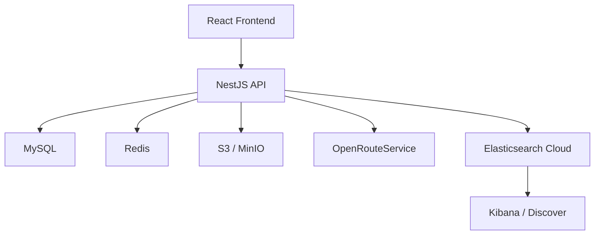

# RoadBook Backend

Backend API for **RoadBook**, a web application for planning, documenting, and sharing road trips.

Users can create routes, organize stops, calculate route geometry and travel estimates, upload photos, interact through comments and likes, save routes to favorites, and discover routes created by other users.

## Features

- Registration, login, logout, and token refresh
- JWT authentication with HTTP-only cookies
- User profiles, avatars, preferred language, and public profiles
- Route CRUD with user-specific unique slugs
- Tags and ordered route stops with reordering
- Place search, geocoding, and automatic route calculation
- Distance, duration, and route geometry calculation
- Route cover images and photo galleries
- Comments, likes, and favorites
- Pagination, filtering, sorting, and search
- English and Russian API error localization
- Request IDs for request/error correlation
- Structured HTTP logging with Elasticsearch Cloud and Kibana Discover
- Swagger / OpenAPI documentation
- Postman collection
- Demo data seeding

## Tech Stack

- **Node.js 22**
- **NestJS 11**
- **TypeScript**
- **Prisma ORM**
- **MySQL 8.4**
- **Redis**
- **Docker / Docker Compose**
- **MinIO** for local S3-compatible storage
- **AWS S3** for production storage
- **OpenRouteService / HeiGIT APIs**
- **Elasticsearch Cloud**
- **Kibana Discover**
- **JWT** with HTTP-only cookies
- **Swagger / OpenAPI**
- **nestjs-i18n**

## Architecture



### Environments

**Local**

```text
NestJS
├── MySQL
├── Redis
└── MinIO

NestJS ──> OpenRouteService
NestJS ──> Elasticsearch Cloud
```

**Production**

```text
NestJS
├── MySQL
└── Redis

NestJS ──> AWS S3
NestJS ──> OpenRouteService
NestJS ──> Elasticsearch Cloud
```

MinIO is used only for local development. Production uses AWS S3.

## Main Data Model

Main Prisma entities:

- `User`
- `Route`
- `RouteStop`
- `RoutePhoto`
- `Tag`
- `RouteTag`
- `Comment`
- `Like`
- `Favorite`

Routes belong to users and can contain ordered stops, photos, tags, comments, likes, and favorites.

Route slugs are unique per user.

## Requirements

For local development:

- Docker
- Docker Compose v2
- Make

Node.js and MySQL do not need to be installed directly on the host when Docker is used.

## Environment Setup

Create local environment files:

```bash
cp .env.example .env
cp .env.local.example .env.local
```

`.env` contains the base / production-oriented configuration. `.env.local` overrides values for local development.

Configuration includes application ports, MySQL, Redis, JWT, CORS, S3 / MinIO, OpenRouteService, Elasticsearch, and seed settings.

Use the example environment files as the source of truth for available variables.

> Never commit real secrets, API keys, passwords, or production credentials.

## Quick Start

Build and start the local environment:

```bash
make local-build
```

For later starts:

```bash
make local-up
```

Seed demo data:

```bash
make prisma-seed
```

Swagger is then available at:

```text
http://localhost:${APP_EXTERNAL_PORT}/api/docs
```

Stop the environment:

```bash
make local-down
```

### Local services

Exact ports are configured through `.env` and `.env.local`.

| Service | Address |
|---|---|
| NestJS API | `http://localhost:${APP_EXTERNAL_PORT}` |
| Swagger | `http://localhost:${APP_EXTERNAL_PORT}/api/docs` |
| MySQL | `localhost:${MYSQL_EXTERNAL_PORT}` |
| Redis | `localhost:${REDIS_EXTERNAL_PORT}` |
| MinIO API | `http://localhost:${MINIO_EXTERNAL_PORT}` |
| MinIO Console | `http://localhost:${MINIO_CONSOLE_EXTERNAL_PORT}` |
| Prisma Studio | `http://localhost:${PRISMA_STUDIO_EXTERNAL_PORT}` |

## Database & Demo Data

The project is already configured for MySQL. There is no need to run `prisma init`.

Useful Prisma commands:

| Command | Description |
|---|---|
| `make prisma-generate` | Generate Prisma Client |
| `make migrate-dev` | Create and apply a development migration |
| `make migrate-deploy` | Apply existing migrations in production |
| `make prisma-studio` | Start Prisma Studio |
| `make prisma-seed` | Create demo data |

The seed can create users, tags, routes, stops, comments, likes, and favorites.

Demo image assets are stored under:

```text
prisma/seed-assets/
├── avatars/
└── routes/
```

The seed uploads image assets to the configured S3-compatible storage.

> The seed script is intended for development/demo data. Do not run it against production unless explicitly intended.

Prisma schema and migrations are committed to Git:

```text
prisma/schema.prisma
prisma/migrations/
```

## Authentication

RoadBook uses JWT authentication stored in HTTP-only cookies:

- `access_token` — short-lived access token
- `refresh_token` — used to obtain a new access token

Protected endpoints require a valid authentication cookie.

CORS is configured with credentials enabled so the frontend can use cookie-based authentication.

## Request IDs & API Errors

Each incoming request receives a request ID.

If the client sends `X-Request-ID`, that value is reused. Otherwise, the backend generates a UUID.

The request ID is:

- returned in the `X-Request-ID` response header
- included in structured HTTP logs
- included in normalized API error responses

Example:

```json
{
  "statusCode": 404,
  "code": "ROUTE_NOT_FOUND",
  "message": "Route not found",
  "details": [],
  "requestId": "request-uuid",
  "timestamp": "2026-09-21T08:21:59.648Z",
  "path": "/api/routes/999999999"
}
```

Validation errors use the same general structure with field-specific details.

## Internationalization

API error messages support:

- English (`en`)
- Russian (`ru`)

The language is resolved from the `Accept-Language` header. English is the fallback language.

## Logging & Monitoring

RoadBook uses structured HTTP logging and centralized log storage in Elasticsearch Cloud.

HTTP logs can include:

```text
@timestamp
level
service
environment
requestId
method
path
statusCode
durationMs
userId
ip
userAgent
message
```

Logs are written to the application console and sent asynchronously to Elasticsearch.

A temporary Elasticsearch failure does not prevent the API from serving the original HTTP request.

Logs can be inspected in Kibana Discover using the `RoadBook Logs` data view.

Example KQL filter:

```text
statusCode >= 400
```

Useful columns:

```text
@timestamp | method | path | statusCode | durationMs | requestId
```

The shared `requestId` allows API responses, logs, and errors to be correlated.

## Storage

RoadBook stores:

- user avatars
- route cover images
- route gallery photos

Local development uses MinIO. Production uses AWS S3.

Both use the same storage abstraction configured through environment variables.

## Routing & Geocoding

OpenRouteService / HeiGIT APIs are used for:

- place search
- geocoding
- route calculation
- distance and duration calculation
- route geometry

The API key is configured through `ORS_API_KEY`.

> Do not commit the real key.

## API Documentation & Postman

Swagger UI:

```text
http://localhost:${APP_EXTERNAL_PORT}/api/docs
```

It documents the HTTP API and cookie-based authentication.

A Postman collection with prepared requests is also included in the repository.

Configure:

```text
base_url = http://localhost:${APP_EXTERNAL_PORT}/api
```

After login, Postman stores the HTTP-only authentication cookies automatically.

## Docker

The Dockerfile uses three stages:

- `development` — installs dependencies and runs the NestJS development server
- `build` — generates Prisma Client and builds the application
- `production` — runs the compiled application with production dependencies

The local Compose setup mounts source code and uses a dedicated `node_modules` volume.

Persistent volumes are used for MySQL, Redis, and local MinIO data.

## Production

Start production:

```
make prod-up
```

Apply migrations:

```
make migrate-deploy
```

Before deployment:

- replace example secrets
- configure production `FRONTEND_URL`
- configure MySQL and Redis credentials
- configure AWS S3
- configure `ORS_API_KEY`
- configure Elasticsearch Cloud credentials
- apply Prisma migrations

For AWS S3 on EC2, prefer an IAM role over permanent AWS access keys when available.

## Make Commands

| Command | Description |
|---|---|
| `make local-build` | Build and start the local stack |
| `make local-up` | Start the local stack |
| `make local-down` | Stop the local stack |
| `make local-restart` | Rebuild and restart the local stack |
| `make local-logs` | Follow NestJS logs |
| `make local-ps` | Show local containers |
| `make local-config` | Show resolved local Compose config |
| `make local-reset` | Remove local containers and volumes |
| `make app-shell` | Open application container shell |
| `make app-shell-root` | Open shell as root |
| `make prisma-generate` | Generate Prisma Client |
| `make prisma-studio` | Start Prisma Studio |
| `make prisma-seed` | Seed demo data |
| `make migrate-dev` | Create/apply a development migration |
| `make migrate-deploy` | Apply migrations in production |
| `make prod-up` | Build and start production |
| `make prod-down` | Stop production |
| `make prod-restart` | Restart production |
| `make prod-logs` | Follow production logs |
| `make prod-ps` | Show production containers |

> `make local-reset` removes Docker volumes, including local MySQL, Redis, and MinIO data.

## Security Notes

- Never commit `.env` files containing real secrets.
- Keep JWT, OpenRouteService, and Elasticsearch credentials private.
- Do not expose MySQL or Redis publicly in production unless explicitly required.
- Prefer IAM roles over permanent AWS access keys on EC2.
- Authentication cookies are HTTP-only.

## Project Status

The main RoadBook backend functionality is implemented.

Current phase: **production deployment and final validation**.

## Possible Future Improvements

- Password recovery via email
- Email verification
- Automated integration / end-to-end test coverage
- CI/CD pipeline
- Additional Kibana dashboards and alerting